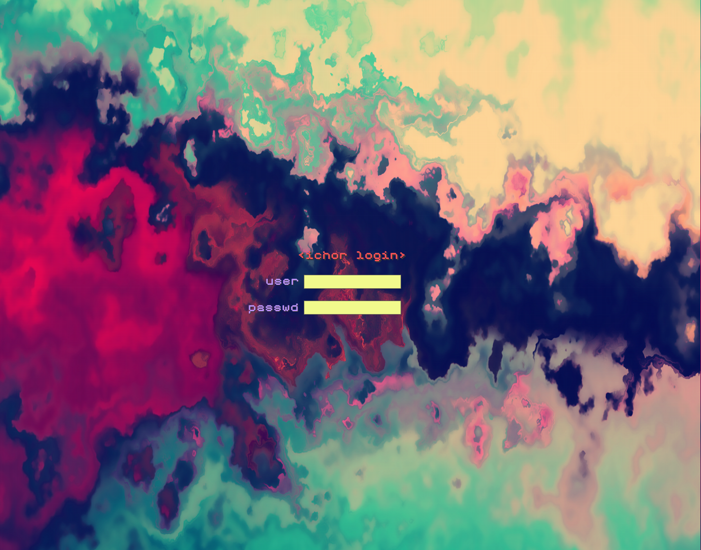

# 🧛‍♂️ SLiM-dracuburl

A sleek, custom SLiM (Simple Login Manager) theme featuring:

    🔤 Custom font integration

    🌙 Dracula-inspired color palette

## 📸 Preview


## 📁 Files Included

    slim.theme – Main theme configuration, edit positioning as needed.

    background.png – Change this to whatever background you want

    TiposkaDev.ttf – Custom font based on Tiposka with the only change being the "1" was edited for better
    differentiation between the number "1" and letter "i".

    panel.png – Contains the login field image. Colors and alpha can be edited in GIMP.

## 🐧 Installation Guide (Gentoo)
```bash
git clone https://github.com/1ch0r/dracuburl.git
cd dracuburl
sudo cp -r dracuburl /usr/share/slim/themes/dracuburl
sudo mkdir -p /usr/share/fonts/tiposka-dev
sudo cp TiposkaDev.ttf /usr/share/fonts/tiposka-dev/
sudo fc-cache -fv
```
Edit /etc/slim.conf and set: "current_theme dracuburl"
```bash
#SLiM caches themes so it won't be recognized until cache gets cleared
sudo reboot
```
